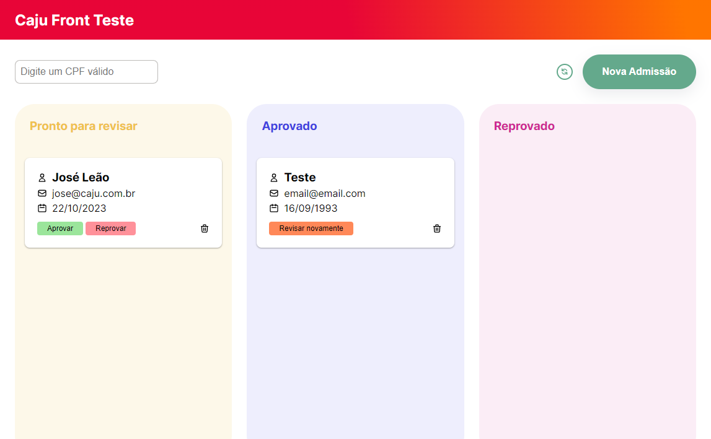

# Criar um registro

Para criar um novo registro, clique no botão __Nova Admissão__ na página inicial.

Preencha todos os dados solicitaods no formulário e clique em __Cadastrar__.

Depois dissom você levado de volta para a tela inicial e poderá encontrar o novo registro na coluna __Pronto para revisar__

